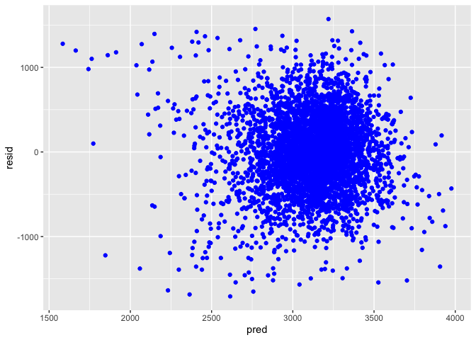
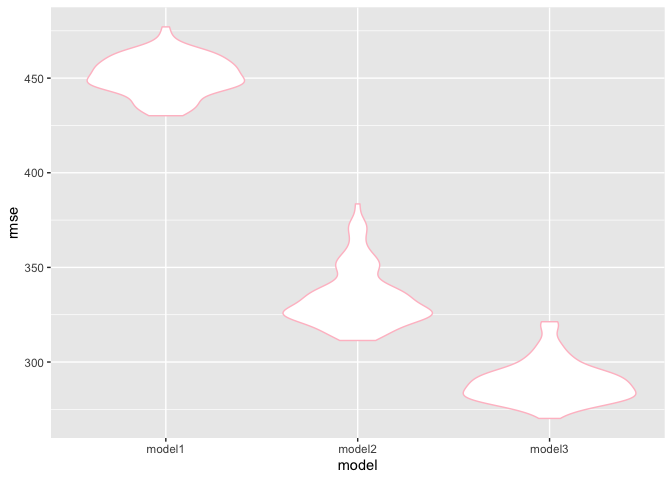

p8105\_hw6\_unp2000
================
Uma Palaniappan

# Problem 1:

``` r
child_data = read_csv("./data/birthweight.csv") %>%
janitor::clean_names () %>%
  mutate( 
      babysex = factor(babysex, levels = c(1,2), labels = c("male", "female")), 
      frace = factor(frace, levels = c(1, 2, 3, 4, 8, 9), labels = c("white", "black", "asian", "puerto rican", "other", "unknown")),
      mrace = factor(mrace, levels = c(1, 2, 3, 4, 8, 9), labels = c("white", "black", "asian", "puerto rican", "other", "unknown")),
      malform = factor(malform, levels = c(0,1), labels = c("absent", "present"))
      )
```

    ## Parsed with column specification:
    ## cols(
    ##   .default = col_double()
    ## )

    ## See spec(...) for full column specifications.

# Regression Model

## Creating Initial Regression Model:

Variables were selected based on a literature search of predictors of
low birthweight. Based on this, babysex, gaweeks, momage, mheight,
parity, ppbmi, pnumlbw, and smoken were selected as variables to include
in the
model.

``` r
bw_model1 = lm(bwt ~ babysex + gaweeks + momage + mheight + parity + ppbmi + pnumlbw + smoken, data = child_data)

bw_model1
```

    ## 
    ## Call:
    ## lm(formula = bwt ~ babysex + gaweeks + momage + mheight + parity + 
    ##     ppbmi + pnumlbw + smoken, data = child_data)
    ## 
    ## Coefficients:
    ##   (Intercept)  babysexfemale        gaweeks         momage        mheight  
    ##     -2043.004        -98.906         64.749          8.794         34.221  
    ##        parity          ppbmi        pnumlbw         smoken  
    ##       121.910         15.411             NA         -7.545

Plotting residuals against fitted values:

``` r
plot_1 = child_data %>%
  modelr::add_residuals(bw_model1) %>%
  modelr::add_predictions(bw_model1) %>%
  ggplot(aes(x = pred, y = resid)) + geom_point (color = "blue") 
```

    ## Warning in predict.lm(model, data): prediction from a rank-deficient fit
    ## may be misleading
    
    ## Warning in predict.lm(model, data): prediction from a rank-deficient fit
    ## may be misleading

``` r
plot_1
```

<!-- -->

## Comparing Models

Model 2: Length at Birth (blength) and Gestational Age (gaweeks)

``` r
bw_model2 = lm(bwt ~ blength + gaweeks, data = child_data)

bw_model2
```

    ## 
    ## Call:
    ## lm(formula = bwt ~ blength + gaweeks, data = child_data)
    ## 
    ## Coefficients:
    ## (Intercept)      blength      gaweeks  
    ##    -4347.67       128.56        27.05

Model 3: Head Circumference (bhead), Length at Birth (blength), Sex
(babysex)

``` r
bw_model3 = lm(bwt ~ bhead + blength + babysex + bhead*blength + bhead*babysex + blength*babysex + bhead*blength*babysex, data = child_data)

bw_model3 
```

    ## 
    ## Call:
    ## lm(formula = bwt ~ bhead + blength + babysex + bhead * blength + 
    ##     bhead * babysex + blength * babysex + bhead * blength * babysex, 
    ##     data = child_data)
    ## 
    ## Coefficients:
    ##                 (Intercept)                        bhead  
    ##                  -7176.8170                     181.7956  
    ##                     blength                babysexfemale  
    ##                    102.1269                    6374.8684  
    ##               bhead:blength          bhead:babysexfemale  
    ##                     -0.5536                    -198.3932  
    ##       blength:babysexfemale  bhead:blength:babysexfemale  
    ##                   -123.7729                       3.8781

Cross Validation and Prediction

``` r
cv_bwt = crossv_mc(child_data, 100)

cv_bwt = 
  cv_bwt %>%
  mutate(bw_model1 = map(train, ~lm(bwt ~ babysex + gaweeks + momage + mheight + parity
                                    + ppbmi + pnumlbw + smoken, data = .x)),
         bw_model2 = map(train, ~lm(bwt ~ blength + gaweeks, data = .x)),
         bw_model3 = map(train, ~lm(bwt ~ bhead + blength + babysex + bhead*blength + bhead*babysex + blength*babysex + bhead*blength*babysex, data = .x))
  ) %>%
  mutate(rmse_model1 = map2_dbl(bw_model1, test, ~rmse(model = .x, data = .y)),
         rmse_model2 = map2_dbl(bw_model2, test, ~rmse(model = .x, data = .y)),
         rmse_model3 = map2_dbl(bw_model3, test, ~rmse(model = .x,  data = .y))
  )

cv_bwt %>%
  select(starts_with("rmse")) %>%
  pivot_longer (
    everything (),
    names_to = "model", 
    values_to = "rmse", 
    names_prefix = "rmse_") %>%
  mutate(model = fct_inorder(model)) %>%
  ggplot(aes(x = model, y = rmse)) + geom_violin(color = "pink")
```

<!-- -->

``` r
cv_bwt
```

    ## # A tibble: 100 x 9
    ##    train test  .id   bw_model1 bw_model2 bw_model3 rmse_model1 rmse_model2
    ##    <lis> <lis> <chr> <list>    <list>    <list>          <dbl>       <dbl>
    ##  1 <res… <res… 001   <lm>      <lm>      <lm>             458.        323.
    ##  2 <res… <res… 002   <lm>      <lm>      <lm>             453.        317.
    ##  3 <res… <res… 003   <lm>      <lm>      <lm>             477.        332.
    ##  4 <res… <res… 004   <lm>      <lm>      <lm>             454.        371.
    ##  5 <res… <res… 005   <lm>      <lm>      <lm>             444.        325.
    ##  6 <res… <res… 006   <lm>      <lm>      <lm>             444.        326.
    ##  7 <res… <res… 007   <lm>      <lm>      <lm>             440.        327.
    ##  8 <res… <res… 008   <lm>      <lm>      <lm>             447.        365.
    ##  9 <res… <res… 009   <lm>      <lm>      <lm>             460.        328.
    ## 10 <res… <res… 010   <lm>      <lm>      <lm>             465.        357.
    ## # … with 90 more rows, and 1 more variable: rmse_model3 <dbl>

# Problem 2:

``` r
weather_df = 
  rnoaa::meteo_pull_monitors(
    c("USW00094728"),
    var = c("PRCP", "TMIN", "TMAX"), 
    date_min = "2017-01-01",
    date_max = "2017-12-31") %>%
  mutate(
    name = recode(id, USW00094728 = "CentralPark_NY"),
    tmin = tmin / 10,
    tmax = tmax / 10) %>%
  select(name, id, everything())
```

    ## Registered S3 method overwritten by 'crul':
    ##   method                 from
    ##   as.character.form_file httr

    ## Registered S3 method overwritten by 'hoardr':
    ##   method           from
    ##   print.cache_info httr

    ## file path:          /Users/umapalaniappan/Library/Caches/rnoaa/ghcnd/USW00094728.dly

    ## file last updated:  2019-09-26 10:26:03

    ## file min/max dates: 1869-01-01 / 2019-09-30

``` r
set.seed(1)

boot_function = function(df) {
  sample_frac(df, size = 0.5, replace = TRUE)
}
```

``` r
boot_straps_sample = 
  tibble(
    strap_number = 1:5000,
    strap_sample = rerun(5000, boot_function(weather_df))
  )
```
